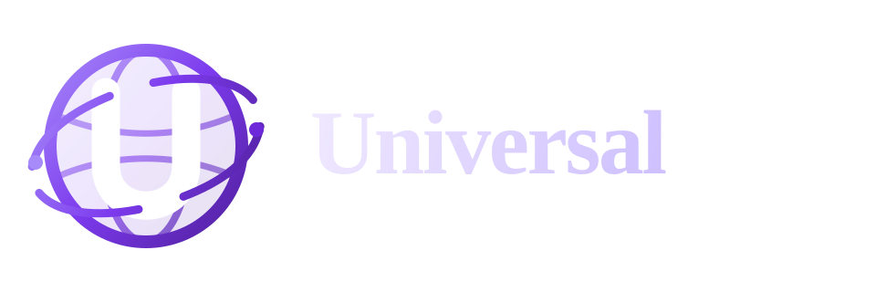
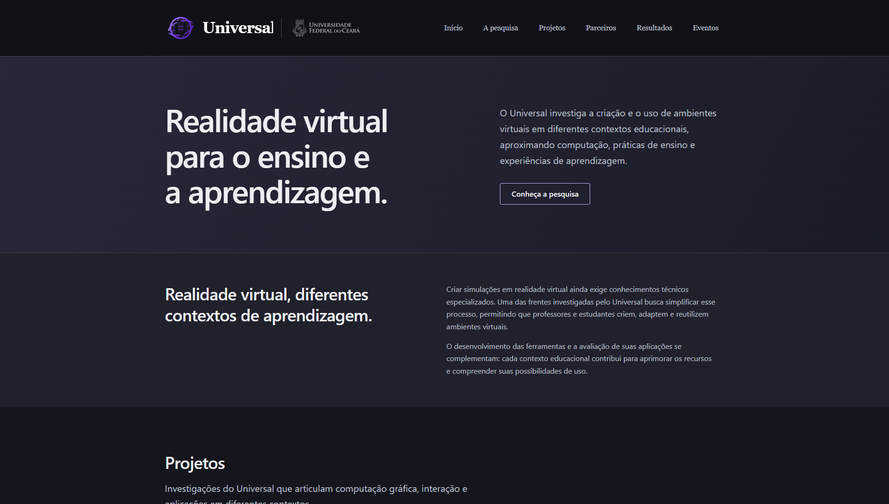
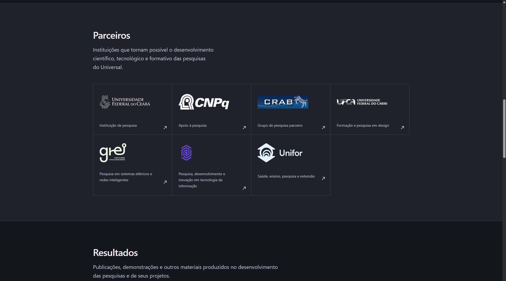
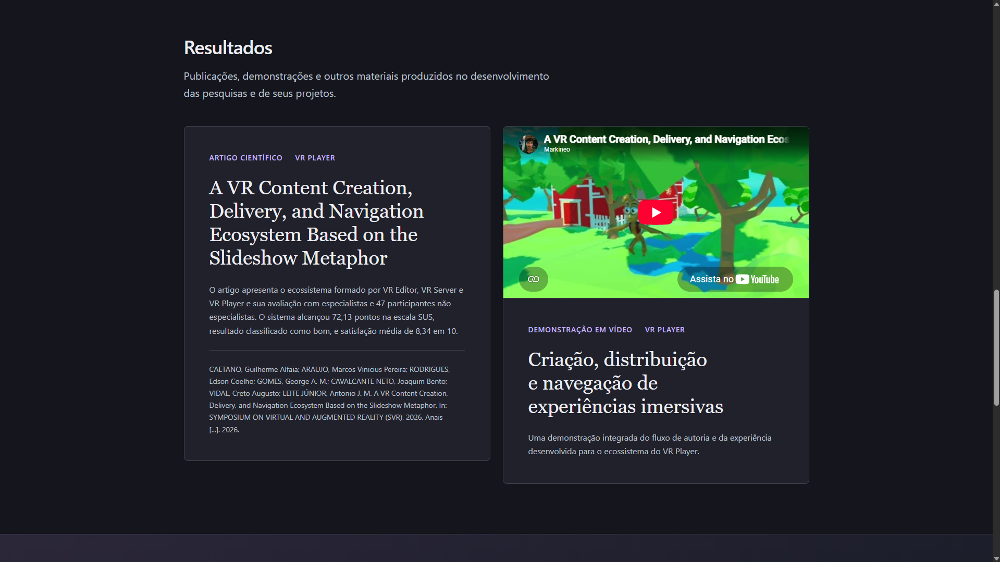

<p align="center">
  
</p>

<p align="center">
  Portal acadêmico dedicado às pesquisas do Universal em realidade virtual,
  computação gráfica e experiências de aprendizagem.
</p>

<p align="center">
  <strong><a href="https://universal.markineo.com.br/">Acessar o portal</a></strong>
</p>

<p align="center">
  
  
  
</p>

## Conteúdo

O portal apresenta:

- a proposta de pesquisa do Universal;
- projetos desenvolvidos, começando pelo VR Player;
- instituições e grupos parceiros;
- publicações, demonstrações e outros resultados;
- eventos e atividades acadêmicas.

O conteúdo é mantido separadamente dos componentes visuais, permitindo acrescentar
projetos, resultados, parceiros e eventos sem duplicar a estrutura das seções.

## Tecnologias

- [Astro 7](https://astro.build/)
- TypeScript em modo estrito
- HTML semântico e CSS
- geração completamente estática

Não há dependências de interface nem recursos exclusivos da plataforma de
hospedagem.

## Desenvolvimento

### Requisitos

- Node.js 22.12 ou superior
- npm 10 ou superior

Instale as dependências e inicie o servidor local:

```sh
npm install
npm run dev
```

O endereço padrão de desenvolvimento é `http://localhost:4321`.

## Verificação e build

```sh
npm run check
npm run build
```

`npm run check` executa a verificação do projeto Astro e dos tipos. O build de
produção é gerado em `dist/` e pode ser servido por qualquer servidor HTTP
estático.

## Licença

O código-fonte está disponível sob a [licença Apache 2.0](./LICENSE).
Marcas, logotipos e materiais de terceiros não são licenciados automaticamente
com o código.
